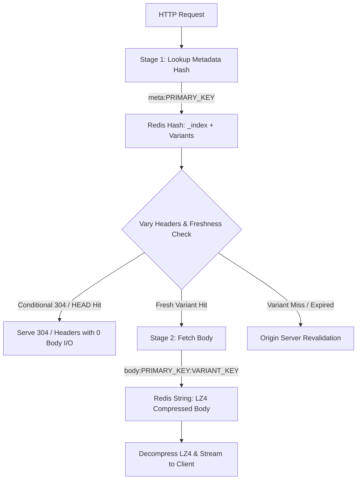

# Titip Redis Storage Engine

High-performance, low-allocation Redis storage backend for `titip` HTTP caching middleware, powered by [`rueidis`](https://github.com/redis/rueidis).

---

## 1. System Requirements

- **Redis 7.0+** (or Redis 8.0+ / Valkey 7.2+ / Dragonfly)
  - Requires native **`EXPIRE ... GT`** and **`EXPIRE ... NX`** command extensions introduced in Redis 7.0.
  - Requires atomic Redis Hash commands (`HSET`, `HMGET`, `HGETALL`, `HKEYS`).
- **Go 1.22+**

---

## 2. Storage Architecture & Two-Stage Resolution

Titip decouples cache lookups into a high-speed **Two-Stage Resolution** model to eliminate unnecessary Body I/O during metadata validation, conditional `304 Not Modified` checks, and `HEAD` requests.



### Redis Key Layout

| Key Pattern | Redis Type | Description |
| :--- | :--- | :--- |
| `<prefix>meta:<primaryKey>` | **Hash** | Holds Stage 1 metadata index (`_index` field) and all variant header descriptors (`<variantKey>` fields). |
| `<prefix>body:<primaryKey>:<variantKey>` | **String** | Holds the LZ4-compressed response payload for an individual variant. |
| `<prefix>tag:<tag>` | **Set** | Set of Primary Keys indexed under a specific surrogate tag (e.g. `category:tech`). |

---

## 3. Data Model & Protobuf Serialization

### A. Metadata Hash Fields (`<prefix>meta:<primaryKey>`)

1. **`_index` Field (`CacheMetadata` Protobuf)**:
   - Contains lean metadata common to the primary URL:
     - `PrimaryKey`: Canonical URL / key string.
     - `VaryHeaderNames`: Ordered list of `Vary` header names (e.g. `["Accept-Encoding", "Accept-Language"]`).
     - `CreatedAtUnixNano`: Creation timestamp.
     - `ExpiresAtUnixNano`: Cache expiration timestamp.
     - `StaleUntilUnixNano`: Stale-while-revalidate expiration timestamp.
     - `Tags`: Surrogate cache tags.
     - `IsSoftPurged`: Boolean flag indicating if the entry was soft-purged.

2. **`<variantKey>` Fields (`VariantInfo` Protobuf)**:
   - Each variant (e.g. `default`, `gzip`, `br`, `en-US`) has its own field inside the Hash:
     - `VariantKey`: Variant identifier.
     - `StatusCode`: HTTP response status code (e.g. 200, 404).
     - `ResponseHeaders`: Compressed map of response headers.
     - `Etag`: Response ETag validator.
     - `LastModifiedUnixNano`: Last-Modified timestamp.
     - `RawBodySize`: Original uncompressed payload size.
     - `CompressedBodySize`: LZ4-compressed payload size.

### B. Variant Body Keys (`<prefix>body:<primaryKey>:<variantKey>`)

- Stores the raw bytes of the LZ4-compressed HTTP response body.
- Retained for `EffectiveTTL + max(StaleWhileRevalidateTTL, StaleIfErrorTTL)`.

---

## 4. Write Pipeline (`SetVariant`)

When saving or updating a cached variant, Titip executes an **atomic 5-operation pipeline in a single network roundtrip** (`DoMulti`):

```go
cmds := []rueidis.Completed{
    // 1. Atomically update metadata index and variant headers in Hash
    HSET metaKey _index <metaBytes> <variantKey> <varBytes>,

    // 2. Save LZ4-compressed body with retention TTL
    SET bodyKey <body> EX <storageTTL>,

    // 3. Dynamic TTL: Set initial TTL if persistent (NX)
    EXPIRE metaKey <storageTTL> NX,

    // 4. Dynamic TTL: Extend metadata TTL if this variant has a longer TTL (GT)
    EXPIRE metaKey <storageTTL> GT,

    // 5. Index tags in Redis Sets
    SADD tagKey <primaryKey>,
}
```

### Dynamic Metadata TTL Extension

Because multiple variants for the same URL can have different expiration times (or be generated hours apart), the metadata Hash TTL must always equal the expiration of the **longest-surviving variant**.

- **No Read-Modify-Write**: Titip avoids fetching, unmarshaling, and rewriting entire metadata records.
- **Native `EXPIRE ... GT`**: Redis 7+ native Greater-Than comparison updates the Hash TTL if and only if the new variant's TTL exceeds the existing remaining TTL.

---

## 5. Invalidation & Purging Mechanics

### A. URL Purging (`Purge(ctx, primaryKey, soft)`)

1. **Hard Purge (`Purge(ctx, primaryKey, soft=false)`)**:
   - Fetches all variant field names using `HKEYS metaKey`.
   - Atomically executes a pipelined `DEL` deleting `metaKey` and every associated `bodyKey` (`body:<primaryKey>:<variantKey>`).
   - **Guarantees zero orphaned body keys** in Redis.

2. **Soft Purge (`Purge(ctx, primaryKey, soft=true)`)**:
   - Executes an atomic Lua script verifying `_index` existence and sets `_soft_purged` to `"1"` directly in the Redis hash (zero read-modify-write).
   - Preserves all variant body keys intact so concurrent requests can serve stale cached content while asynchronously revalidating in the background.

---

### B. Tag Purging (`PurgeByTag(ctx, tag, soft)`)

1. **Hard Tag Purge (`PurgeByTag(ctx, tag, soft=false)`)**:
   - Streams primary keys in `<prefix>tag:<tag>` via non-blocking `SSCAN`.
   - Pipelines `HKEYS` queries across matched primary keys.
   - Atomically deletes the tag Set key, all metadata Hash keys, and all variant body keys.

2. **Soft Tag Purge (`PurgeByTag(ctx, tag, soft=true)`)**:
   - Streams primary keys in `<prefix>tag:<tag>` via non-blocking `SSCAN`.
   - Sets `_soft_purged 1` across all matched metadata hashes while leaving body keys intact for stale fallbacks.

---

## 6. Go Usage Example

```go
package main

import (
 "context"
 "log"
 "time"

 "github.com/redis/rueidis"

 "github.com/indragunawan/titip"
 storageRedis "github.com/indragunawan/titip/storage/redis"
)

func main() {
 // 1. Initialize Rueidis client
 client, err := rueidis.NewClient(rueidis.ClientOption{
  InitAddress:  []string{"127.0.0.1:6379"},
  DisableCache: true,
 })
 if err != nil {
  log.Fatalf("failed to connect to Redis: %v", err)
 }
 defer client.Close()

 // 2. Initialize Titip Redis Storage Engine
 store, err := storageRedis.New(
  client,
  storageRedis.WithKeyPrefix("myapp:cache:"),
 )
 if err != nil {
  log.Fatalf("failed to initialize storage: %v", err)
 }

 // 3. Attach storage to Titip
 engine, err := titip.New(
  titip.WithStorage(store),
  titip.WithOriginTimeout(5*time.Second),
  titip.WithStorageTimeout(2*time.Second),
 )
 if err != nil {
  log.Fatalf("failed to initialize titip: %v", err)
 }
 defer engine.Close(context.Background())
}
```
